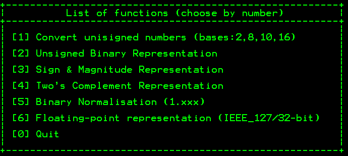

# NumberConverter
A Python-based little tool for number conversion between number systems (Decimal, Binary, Octal, Hexadecimal). 
Python 3.x

## Available Functions:
1. Conversion from/to numbers in Decimal,Binary,Octal, Hexadecimal.
2. Show binary representation in Unsigned, Sign-and-Magnitude, and Two's Complements.
3. Binary normalisation (1.xxx)
4. Floating-point representation (Excess 127/32-bit)
 

## Usage 
The file can be used in two ways: 
1. Direct double clicking, and follow instructions.
2. Open it from within an IPython environment: be carful when converting from base-16 as you need to use ' or " with input. E.g. to enter F.01 you need to use 'F.01'

 **If you have any problem, please report issue to the project or email nalbishry@kau.edu.sa** 
